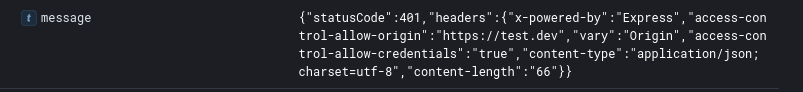
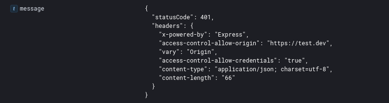
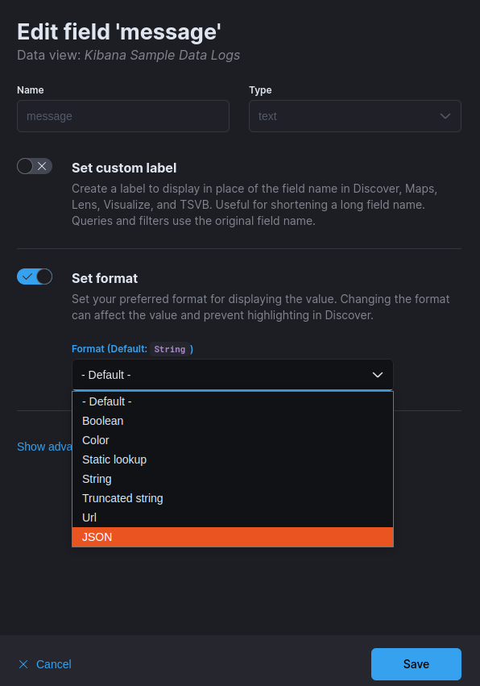

# JSONFieldFormatter

Kibana `8.8.0` plugin for formatting text field containing JSON string into pretty printed JSON by wrapping it with `<pre>` tags.

In Discover view turns this ...

... into this

No idea why do we even have to do this in 2024.

## Install
~~~
kibana-plugin install https://github.com/oinqu/jsonfield-formatter/raw/refs/heads/main/build/jsonfieldFormatter-8.8.0.zip
~~~

For Docker images [build like this](https://www.elastic.co/guide/en/cloud-on-k8s/current/k8s-custom-images.html):
~~~
FROM docker.elastic.co/kibana/kibana:8.8.0
RUN /usr/share/kibana/bin/kibana-plugin install https://github.com/oinqu/jsonfield-formatter/raw/refs/heads/main/build/jsonfieldFormatter-8.8.0.zip
RUN /usr/share/kibana/bin/kibana --optimize
~~~

## Configure
1. Go to Stack Management > Data views
1. Select text field you want to parse and set its format to JSON

## Develop
1. Set up [Kibana local dev env](https://github.com/elastic/kibana/blob/v8.8.0/dev_docs/getting_started/setting_up_a_development_env.mdx).

1. Clone this repo into `kibana/plugins/jsonfield-formatter`

1. Run this for development:
    ~~~
    cd plugins/jsonfield_formatter
    node ../../scripts/plugin_helpers dev
    ~~~
    This will create `kibana/plugins/jsonfield-formatter/target/` directory which gets picked up by kibana running in dev mode.  

1. Run this to build:
    ~~~
    node ../../scripts/plugin_helpers build
    ~~~
